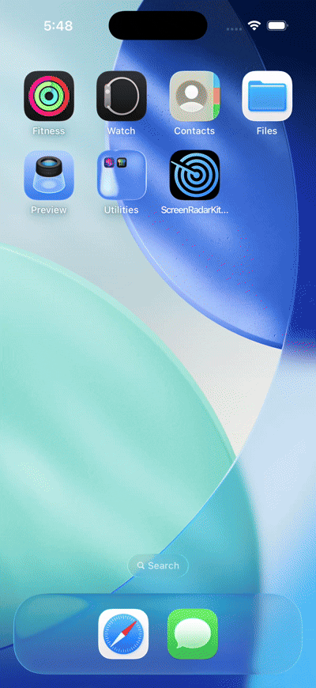

<p align="center">
  
</p>

<p align="center">
  
  
  
</p>

# ScreenRadarKit

A lightweight debug tool for iOS developers to instantly see which screen they're on while testing their app.

---

## Demo

<p align="center">
  
</p>

The overlay label updates automatically as the user moves from screen to screen — no manual calls needed. Tapping the label opens the trail bottom sheet, showing every screen visited in order with the current one highlighted, and the label itself can be dragged to any edge of the screen and stays there across launches.

---

## Features

- 📱 **Real-time screen name overlay** — floating label shows the active `UIViewController` class name
- 🔄 **Auto-detection** — uses method swizzling on `viewDidAppear` / `viewDidDisappear`, no manual calls needed
- 👆 **Tap for trail details** — tap the label to open a bottom sheet and dump the hierarchy/trail to the Xcode console
- 🧭 **Navigation breadcrumbs** — records every visited screen, including repeats and back navigation
- ⏱️ **Optional screen timing** — pass `showTimeOnTrail: true` to include durations in the trail
- 🫥 **Passthrough touches** — the overlay never blocks your app's own interactions
- ⚡ **Simple setup** — call `ScreenRadar.enable()` once inside your app's `#if DEBUG` block
- 🌗 **Dark & light mode support** — overlay automatically adapts to system appearance
- 🖐️ **Draggable overlay** — optionally drag the label anywhere on screen, snaps to nearest edge
- 🛡️ **Debug-only by usage** — wrap `ScreenRadar.enable()` in `#if DEBUG` so it never runs in production

---

## Requirements

| | Minimum |
|---|---|
| iOS | 13.0+ |
| Swift | 5.7+ |
| Xcode | 14.0+ |

---

## Installation

### Swift Package Manager (Recommended)

1. In Xcode, go to **File → Add Package Dependencies…**
2. Enter the repository URL:
   ```
   https://github.com/sanketk2020/ScreenRadarKit
   ```
3. Select **Up to Next Major Version** starting from `1.0.0`
4. Add to your **app target** (not a framework target)

Or add it manually to your `Package.swift`:

```swift
dependencies: [
    .package(url: "https://github.com/sanketk2020/ScreenRadarKit", from: "1.0.0")
],
targets: [
    .target(
        name: "YourApp",
        dependencies: ["ScreenRadarKit"]
    )
]
```

---

## Usage

> Important: ScreenRadar is a debug tool. Always wrap `ScreenRadar.enable()` in `#if DEBUG` in your app target. If you call it from a Release build, the overlay will appear.

`ScreenRadar.enable()` takes two optional parameters:

| Parameter | Default | Description |
|---|---|---|
| `draggable` | `false` | Lets you drag the overlay anywhere on screen; snaps to the nearest edge on release |
| `showTimeOnTrail` | `false` | Adds per-screen duration to the navigation trail shown in the bottom sheet |

### AppDelegate (UIKit)

```swift
import ScreenRadarKit

@main
class AppDelegate: UIResponder, UIApplicationDelegate {
    func application(
        _ application: UIApplication,
        didFinishLaunchingWithOptions launchOptions: [UIApplication.LaunchOptionsKey: Any]?
    ) -> Bool {

        #if DEBUG
        ScreenRadar.enable(draggable: true, showTimeOnTrail: true)
        #endif

        return true
    }
}
```

### SceneDelegate (iOS 13+)

```swift
import ScreenRadarKit

class SceneDelegate: UIResponder, UIWindowSceneDelegate {
    func scene(
        _ scene: UIScene,
        willConnectTo session: UISceneSession,
        options connectionOptions: UIScene.ConnectionOptions
    ) {
        #if DEBUG
        ScreenRadar.enable(draggable: true, showTimeOnTrail: true)
        #endif
    }
}
```

> Prefer the plain `ScreenRadar.enable()` call if you don't need dragging or trail timing — both parameters are optional and default to `false`.

### Objective-C

```objc
#if DEBUG
@import ScreenRadarKit;

[ScreenRadar enableWithDraggable:NO showTimeOnTrail:NO];
#endif
```

With draggable overlay and trail timing:

```objc
#if DEBUG
[ScreenRadar enableWithDraggable:YES showTimeOnTrail:YES];
#endif
```

Disable:

```objc
[ScreenRadar disable];
```

> Objective-C callers should use the full selector because Swift default parameters are not exposed as Objective-C overloads.

> ⚠️ **SwiftUI** — ScreenRadarKit is UIKit-focused today. Native SwiftUI apps may only surface wrapper controllers such as `UIHostingController`, so SwiftUI screen-name tracking is not supported yet. SwiftUI support may be explored in a future version.

---

## Draggable Overlay

By default the overlay is fixed at the top center. Pass `draggable: true` to let developers drag it anywhere on screen. It snaps to the nearest edge — top, bottom, left, or right — when released. Position is saved across app launches.

```swift
#if DEBUG
ScreenRadar.enable(draggable: true)
#endif
```

---

## Navigation Trail

Tap the overlay label to open a bottom sheet with the current session trail and the previous session trail. The current screen is highlighted, and you can clear or export the trail as a plain text file.

```swift
#if DEBUG
ScreenRadar.enable(showTimeOnTrail: true)
#endif
```

You can combine options:

```swift
#if DEBUG
ScreenRadar.enable(draggable: true, showTimeOnTrail: true)
#endif
```

---

## Dark & Light Mode

The overlay automatically adapts to the system appearance — no extra setup needed.

| Light Mode | Dark Mode |
|---|---|
| Black background, white text | White background, black text |

> Make sure `UIUserInterfaceStyle` is **not** forced in your `Info.plist`, otherwise the system appearance change will have no effect.

---

## How It Works

| Component | Responsibility |
|---|---|
| `ScreenRadar` | Public entry point (`enable()` / `disable()`) |
| `UIViewController+Swizzling` | Hooks into `viewDidAppear` & `viewDidDisappear` via Objective-C runtime swizzling |
| `ViewControllerTracker` | Resolves the topmost VC from the window hierarchy; prints hierarchy on tap |
| `OverlayWindow` | Creates a `UIWindow` above all other windows with the floating label |
| `PassthroughWindow` | Overrides `hitTest` so touches fall through to the app beneath |
| `TrailLogger` | Records, persists, clears, and exports screen trails |
| `TrailBottomSheet` | Presents current and previous session trails |

---

## Console Output

When active, ScreenRadar prints to the Xcode console:

```
🚀 ScreenRadar enabled
📱 ScreenRadar → HomeViewController

// After tapping the label:
==========================
📡 ScreenRadar Hierarchy
==========================
↳ UINavigationController
   Navigation Stack:
   • HomeViewController
   • ProfileViewController
   Visible:
      ↳ ProfileViewController
==========================

📋 ScreenRadar Trail Export
Project: SampleApp
Session: Current
Generated: 2026-06-08 12:04:21

01. HomeViewController          <1s
02. MessagesViewController      12s
03. ProfileViewController       ← current
```

---

## Disabling

```swift
ScreenRadar.disable()
```

---

## License

MIT License. See [LICENSE](LICENSE) for details.
